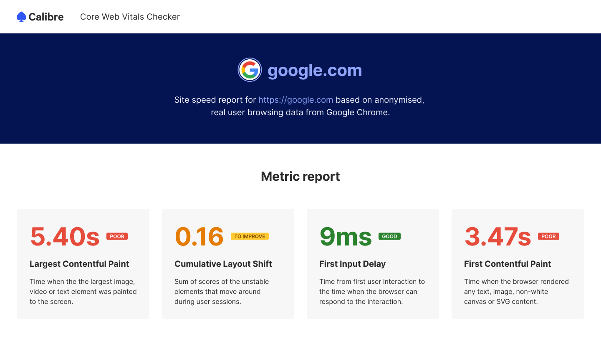

# 📝 Test Assignment
This is a single page web performance report showcasing the Chrome User Experience Report (CruX) data for a selected website:

To complete this test, you will have to use JavaScript, HTML and CSS to build the design and functionality described below.

> ⏱ **We have scoped this task to 8 hours.** Please try to avoid exceeding this limit. It’s okay if you don’t finish the task: follow the steps in the [How To Submit](#-how-to-submit) section!

## 🎨 Design Specification
Review the [design file in Figma](https://www.figma.com/file/gRsIi7uODaoGyQuPS9Z79b/Front-end-Developer-Test-UI?node-id=0%3A1). To access the file and [inspect the properties](https://help.figma.com/hc/en-us/articles/360055203533-Use-the-Inspect-panel) of specific elements you will need a Figma account.

To complete this task, the following design criteria have to be met:

* The implementation has to **reflect the design file**.
* The design uses Inter font, which is available on [Google Fonts](https://fonts.google.com/specimen/Inter).
* The page should be responsive (as documented). Feel free to use your best judgement to adjust element behaviour in-between those resolutions.
* The measurement colours and corresponding labels **depend on thresholds** set for each metric (please refer to [the table below](#-metric-thresholds)).

### 📈 Metric Thresholds

| Metric name | Poor | To Improve | Good |
|---|---|---|---|
| Largest Contentful Paint | above 4s  | 2.51-4s | 2.5s or less |
| Cumulative Layout Shift |  above 0.25 | 0.11-0.25 |  0.10 or less |
| First Input Delay | above 300ms | 101ms-300ms | 100ms or less |
| First Contentful Paint |  above 3s  | 1.81-3s | 1.80s or less |

## 🛠 Functionality Specification

To complete this task, the following functional criteria have to be met:

* You should **pull the data** for four performance metrics from the [CruX API](https://web.dev/chrome-ux-report-api/). If you wish, you can use alternative libraries to communicate with the API.
* Retrieve the data for `https://google.com/` origin. 
* The metrics you obtain from the API should be **formatted accordingly** (unit or unitless depending on the metric type and no more than two decimal points).
* The `report header` (with the dark blue background) section can be entirely hard-coded.

## ❓ Asking Questions
If anything is unclear, you can email us and ask questions about this project at any time!

## 🎉 How To Submit

To submit this test project:

1. Open a Pull Request **in your fork** with the changes.
2. Describe the changes you’ve made in the Pull Request description and include any other details you feel are relevant. If you didn’t finish the task (which is totally fine!), let us know what work is outstanding and how another developer could take it over to complete it. Please **include a link to a preview deployment** too.
3. Send us the **link to the Pull Request**. If you’d like to keep the repository private, please invite @benschwarz and @thefoxis so that we can access it.

### What happens next?

Once we receive your project, we will review it and get back to you about the next steps. No matter the outcome, you will be compensated for your time. Thank you! 🙌🏻 